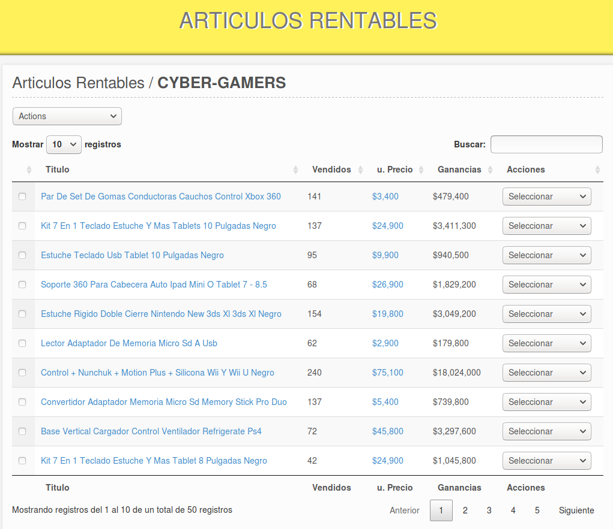

<h1>ARTICULOS RENTABLES EN MERCADO LIBRE</h1>

Encuentra articulos rentables analizando vendedores o filtrados por categoria en la plataforma de <a href='https://www.mercadolibre.com/' target='_blank'>Mercado Libre</a> y todos los paises que ofrece el servicio.

<h1>INSTALANDO APPLICACION</h1>

    Esta aplicación está basada en la web con codeigniter framework y debe tener un servidor web instalado en su sistema operativo como XAMPP o Lampp o un servidor en vivo contratado con alguna empresa de hosting. No requiere ninguna configuración especial en el servidor.

    <ol>
        <li>
         Use un dominio para esta aplicación. Si es un servidor local, cree un dominio virtual como <b> mlrentables.com </ b>. Amablemente, consulte en Google "crear un host virtual para el servidor web apache (XAMPP; LAMPP)", reemplace el servidor web por el suyo.
        </li>
        <li>
          En PHPMYADMIN, cree una base de datos e importe database.sql ubicado en el proyecto raíz.
        </li>
        <li>
          Descargue y suba los archivos de proyecto en su servidor web. Si está trabajando en local y tiene GIT instalado, solo use el comando siguiente de git:  
          <b>git clone https://github.com/rockscripts/Articulos-Rentables-En-MercadoLibre.git</b>
        </li>
        <li>
           Configurar la conexión de la base de datos, establecer el nombre de la base de datos, el usuario, la contraseña y el host <b>/application/config/database.php</b>
        </li>
    </ol>

<b>¡Felicitaciones! Escuche la aplicación escribiendo su dominio en la barra de direcciones preferida del navegador web.</b>

<h1>ICONOS</h1>

Icons made by <a href="https://www.flaticon.com/authors/vectors-market" title="Vectors Market">Vectors Market</a> from <a href="https://www.flaticon.com/" title="Flaticon">www.flaticon.com</a> is licensed by <a href="http://creativecommons.org/licenses/by/3.0/" title="Creative Commons BY 3.0" target="_blank">CC 3.0 BY</a>

Icons made by <a href="http://www.freepik.com" title="Freepik">Freepik</a> from <a href="https://www.flaticon.com/" title="Flaticon">www.flaticon.com</a> is licensed by <a href="http://creativecommons.org/licenses/by/3.0/" title="Creative Commons BY 3.0" target="_blank">CC 3.0 BY</a>
